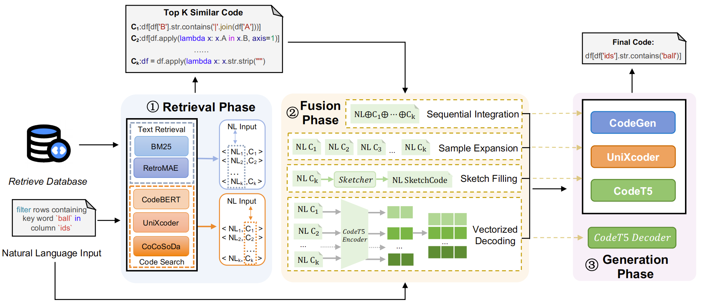

# An Empirical Study of Retrieval-Augmented Code Generation: Challenges and Opportunities
In our paper, we have divided the retrieval-augmented code generation framework into three phases, which are retrieval phase, fusion phase and generation phase. Here is the workflow of the framework:

## 1 Retrieval Phase

We provide five retrieval techniques implementation in this repository. You can access them in fold [Retriever](./).

## 2 Fusion Phase

We provide four techniques implementation in this repository. You can access them in fold [Fusion](./Fusion).

## 3 Generation Phase

We provide four retrieval techniques implementation in this repository. You can access them in fold [Generator](./Generator). 

Three PLMs (i.e., CodeGen, UniXcoder, and CodeT5) and three LLMs (ChatGLM, DeepSeekCoder, and CodeLlama) are adopted in our experiment to evaluate the effectiveness of the retrieval-augmented framework and explore the utilization of the retrieval-augmented framework.

## Results involving all metrics of Table 4
### Table 4.1 Results of the retrieval-augmented model on CONCODE with different retrieval techniques. 

| Model     | Retrieval Technique | EM   | BLEU | ED   | $Sim{AST}$ | CodeBLEU |
| --------- | ------------------- | ------- | ---- | ---- | ---- | ---- |
| CodeGen   | Baseline            | 19.55 | 21.83 | 19.13 | 33.80 | 27.33 |
|           | BM25                | **21.20** | **24.99** | 18.73 | 39.41 | **30.04** |
|           | RetroMAE            | 20.35 | 20.14 | 18.13 | 37.23 | 26.18 |
|           | CodeBERT            | 20.7 | 24.18 | 18.59 | 41.38 | 29.23 |
|           | UniXcoder           | 17.45 | 24.76 | 19.26 | 36.62 | 29.09 |
|           | CoCoSoDa            | 20.60 | 24.98 | **18.04** | **42.38** | 29.97 |
| UniXcoder | Baseline            | 22.80 | 32.42 | 18.74 | 41.11 | 35.73 |
|           | BM25                | **23.50** | **35.80** | **18.58** | **45.83** | **38.57** |
|           | RetroMAE            | 22.35 | 32.02 | 20.03 | 41.26 | 35.47 |
|           | CodeBERT            | 23.00 | 35.15 | 19.07 | 43.46 | 38.13 |
|           | UniXcoder           | 20.25 | 34.79 | 19.97 | 41.71 | 37.71 |
|           | CoCoSoDa            | 23.15 | 34.05 | 19.08 | 42.98 | 37.38 |
| CodeT5    | Baseline            | 21.45 | 36.93 | 23.12 | 46.64 | 40.15 |
|           | BM25                | **23.35** | **40.42** | **21.91** | **47.67** | **43.48** |
|           | RetroMAE            | 22.35 | 37.90 | 24.32 | 43.94 | 42.30 |
|           | CodeBERT            | 23.00 | 39.00 | 23.77 | 44.36 | 43.05 |
|           | UniXcoder            | 20.75 | 38.21 | 22.72 | 44.08 | 41.38 |
|           | CoCoSoDa            | 22.80 | 38.93 | 22.45 | 45.09 | 42.72 |

### Table 4.2 Results of the retrieval-augmented model on CoNaLa with different retrieval techniques. 

| Model     | Retrieval Technique | EM        | BLEU      | ED        | $Sim{AST}$ | CodeBLEU  |
| --------- | ------------------- | --------- | --------- | --------- | ---------- | --------- |
| CodeGen   | Baseline            | 9.00      | 12.74     | 9.48      | 22.15      | 17.30     |
|           | BM25                | 8.60      | 15.58     | 9.28      | 22.41      | 22.24     |
|           | RetroMAE            | **9.80**  | 12.93     | 9.39      | 21.34      | 21.17     |
|           | CodeBERT            | 8.20      | 13.61     | 9.21      | 21.76      | 23.23     |
|           | UniXcoder           | 7.00      | 14.63     | 9.48      | 21.58      | 22.55     |
|           | CoCoSoDa            | 11.00     | **16.50** | **9.18**  | **22.72**  | **23.25** |
| UniXcoder | Baseline            | 10.60     | 12.76     | 9.33      | 24.36      | 20.18     |
|           | BM25                | 11.40     | 13.69     | 9.05      | 25.46      | 20.60     |
|           | RetroMAE            | 10.20     | 13.77     | 9.01      | 24.19      | 20.65     |
|           | CodeBERT            | **11.80** | 13.61     | 9.57      | 26.50      | 20.73     |
|           | UniXcoder           | 11.20     | 13.32     | 9.27      | 23.98      | 19.57     |
|           | CoCoSoDa            | 11.20     | **14.55** | **8.73**  | **29.02**  | **21.48** |
| CodeT5    | Baseline            | 7.40      | 10.55     | 11.87     | 19.69      | 18.80     |
|           | BM25                | 8.00      | **13.26** | 10.46     | 21.29      | **22.49** |
|           | RetroMAE            | 8.60      | 11.28     | 11.38     | 21.93      | 21.76     |
|           | CodeBERT            | 8.60      | 12.53     | 13.27     | 22.23      | 21.18     |
|           | UniXcoder           | **9.80**  | 12.73     | 10.57     | 21.75      | 21.03     |
|           | CoCoSoDa            | 6.80      | 12.24     | **10.32** | **22.24**  | 21.77     |

### Table 4.3 Results of the retrieval-augmented model on HearthStone with different retrieval techniques. 

| Model     | Retrieval Technique | EM        | BLEU      | ED        | $Sim{AST}$ | CodeBLEU  |
| --------- | ------------------- | --------- | --------- | --------- | ---------- | --------- |
| CodeGen   | Baseline            | 10.61     | 50.35     | 23.81     | 58.85      | 40.76     |
|           | BM25                | 15.15     | **54.35** | **21.80** | **64.70**  | **44.00** |
|           | RetroMAE            | 0         | 9.40      | 37.39     | 51.68      | 16.93     |
|           | CodeBERT            | **16.67** | 52.08     | 21.98     | 63.77      | 42.07     |
|           | UniXcoder           | 10.61     | 51.44     | 22.83     | 63.00      | 43.59     |
|           | CoCoSoDa            | 4.55      | 47.27     | 22.30     | 62.84      | 39.10     |
| UniXcoder | Baseline            | 13.64     | 58.60     | 19.38     | 57.14      | 45.70     |
|           | BM25                | **22.73** | **61.00** | **16.90** | **61.92**  | **48.53** |
|           | RetroMAE            | 16.67     | 55.89     | 21.26     | 58.34      | 44.45     |
|           | CodeBERT            | 16.67     | 56.12     | 19.97     | 58.78      | 45.28     |
|           | UniXcoder           | 10.61     | 55.79     | 19.84     | 60.15      | 46.38     |
|           | CoCoSoDa            | 15.15     | 59.25     | 17.34     | 59.89      | 45.91     |
| CodeT5    | Baseline            | 19.70     | 55.96     | 19.76     | 55.14      | 44.49     |
|           | BM25                | 22.73     | **64.35** | **14.95** | **63.65**  | **49.80** |
|           | RetroMAE            | 22.73     | 61.11     | 17.76     | 59.24      | 48.32     |
|           | CodeBERT            | **24.24** | 62.09     | 18.32     | 63.06      | 49.09     |
|           | UniXcoder           | 16.67     | 54.23     | 18.30     | 62.92      | 49.19     |
|           | CoCoSoDa            | 22.73     | 62.51     | 18.96     | 62.84      | 48.87     |

## Additonal Experiment

### KNN-LM

We have also included the implementation of KNN-LM on three datasets. However, as KNN-LM enhances models based on token probability distribution, which diverges from mainstream retrieval-augmented framework, it is not discussed in the paper. The table below contrasts the results of KNN-LM with those of the previously tuned models.

| Dataset     | Models | EM    | BLEU  | ED    | $Sim_{AST}$ | CodeBLEU | Training Time |
| ----------- | ------ | ----- | ----- | ----- | ----------- | -------- | ------------- |
| CONCODE     | CodeT5 | 21.45 | 36.93 | 23.12 | 46.64       | 40.15    | 128 min       |
|             | KNN-LM | 21.80 | 32.96 | 18.67 | 43.35       | 37.52    | 147 min       |
| CoNaLa      | CodeT5 | 7.40  | 10.55 | 11.87 | 19.69       | 17.25    | 13 min        |
|             | KNN-LM | 6.20  | 10.32 | 10.50 | 18.06       | 18.07    | 20 min        |
| HearthStone | CodeT5 | 19.70 | 55.96 | 19.76 | 55.14       | 44.49    | 50 min        |
|             | KNN-LM | 12.12 | 56.27 | 20.39 | 53.75       | 51.52    | 59 min        |

